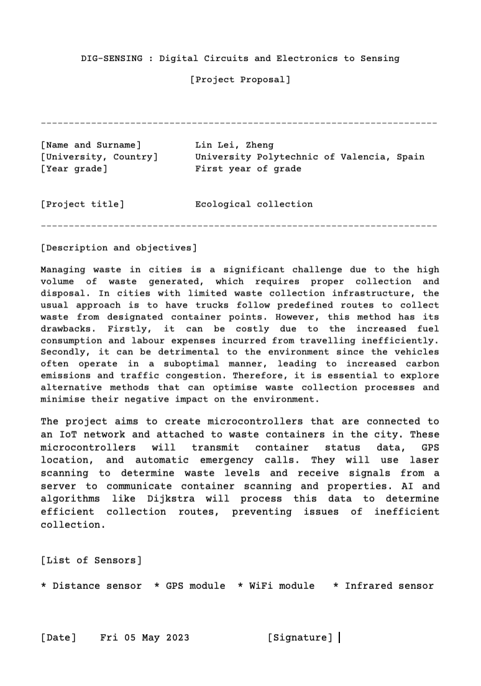
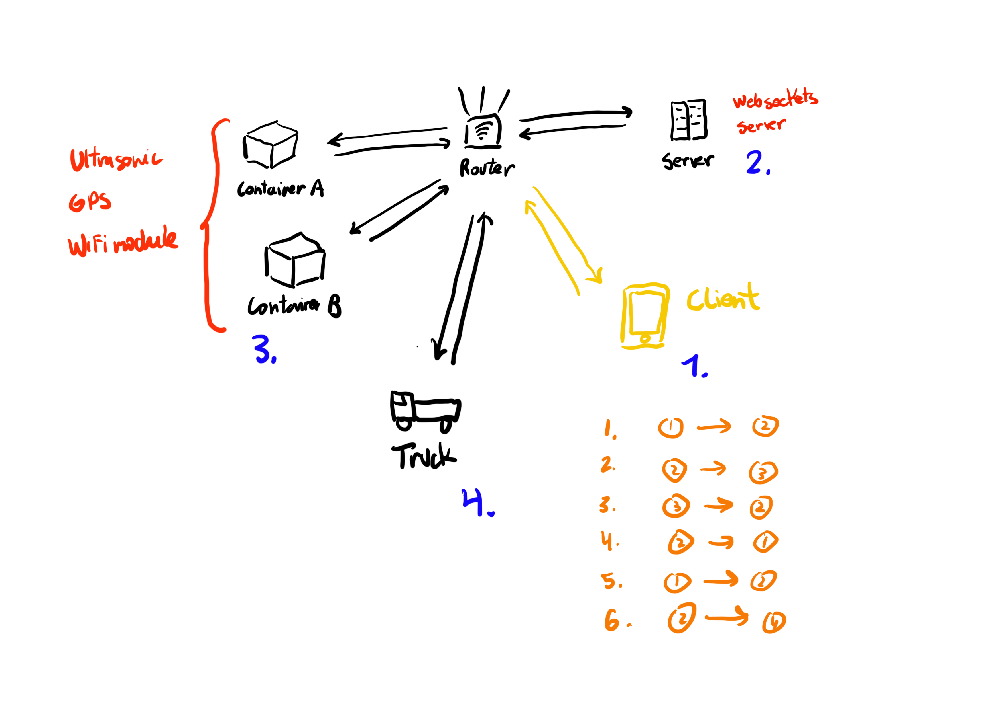

# ESP 32 DIG-Sensing Erasmus+ Project [Ecological Container Management System]

## Description
Managing waste in cities is a significant challenge due to the high volume of waste generated, which requires proper collection and disposal. In cities with limited waste collection infrastructure, the usual approach is to have trucks follow predefined routes to collect waste from designated container points. However, this method has its drawbacks. Firstly, it can be costly due to the increased fuel consumption and labour expenses incurred from travelling inefficiently. Secondly, it can be detrimental to the environment since the vehicles often operate in a suboptimal manner, leading to increased carbon emissions and traffic congestion. Therefore, it is essential to explore alternative methods that can optimise waste collection processes and minimise their negative impact on the environment.
The project aims to create microcontrollers that are connected to an IoT network and attached to waste containers in the city. These microcontrollers will transmit container status data, GPS location, and automatic emergency calls. They will use laser scanning to determine waste levels and receive signals from a server to communicate container scanning and properties. AI and algorithms like Dijkstra will process this data to determine efficient collection routes, preventing issues of inefficient collection.

## Table of Contents

- [ESP 32 Project](#esp-32-project)
- [Description](#description)
    - [Table of Contents](#table-of-contents)
    - [Installation](#installation)
    - [Usage](#usage)
    - [Credits](#credits)
    - [License](#license)

## Installation
1. Install [Arduino IDE](https://www.arduino.cc/en/software)
2. Install [ESP32 Board](https://randomnerdtutorials.com/installing-the-esp32-board-in-arduino-ide-windows-instructions/)
3. Install [ESP32 Libraries](https://randomnerdtutorials.com/install-esp32-filesystem-uploader-arduino-ide/)
4. Install [Python](https://www.python.org/downloads/) and [Node](https://nodejs.org/en/download/)
5. Load code onto ESP32
6. Run `websockets` with `python ./server/server.py`
7. Run simulated container and truck in `websockets` with `python ./server/container/containerX.py` and `python ./server/truck/truckX.py` respectively
8. Run `client` with `npm run start` inside `server` folder

## Usage

## Credits

## License
Apache License 2.0